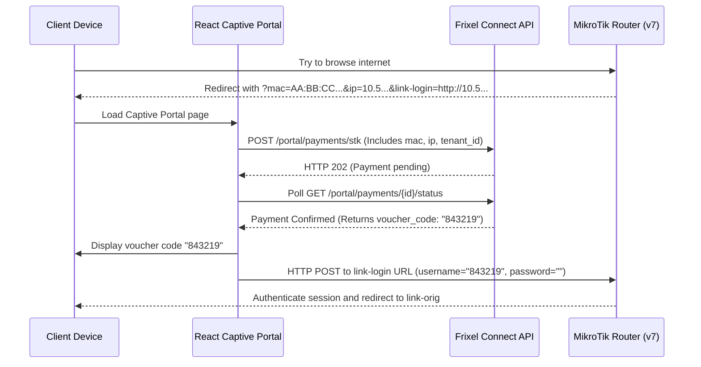
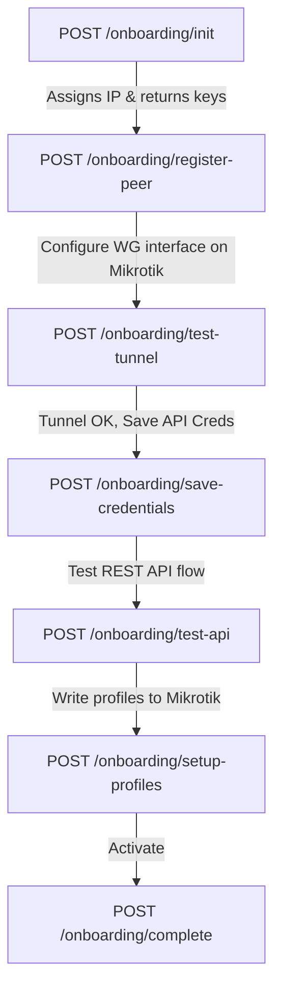

# Frixel Connect API Reference Documentation

Welcome to the Frixel Connect API Reference. This document provides complete contract specifications for the REST API endpoints of the Frixel Connect multi-tenant WiFi billing platform. It contains exact request and response schemas, HTTP status codes, validation rules, webhook callback definitions, and real-world examples using realistic Kenyan test data.

---

## 1. Base Information

### Base URLs
* **Production API Gateway:** `https://api.Frixel Connect.co.ke/api/v1`
* **Local Development Environment:** `http://localhost:8000/api/v1`

### Authentication
Frixel Connect secures its API using JSON Web Tokens (JWT). All authenticated endpoints require the client to supply an `Authorization` header containing a valid Bearer token.

```http
Authorization: Bearer <access_token>
```

#### Token Issuance & Refresh
* Authenticate via `POST /auth/login` or `POST /tenants/register` to receive an `access_token` and a `refresh_token`.
* The `access_token` has a short lifetime (typically **15 minutes**).
* The `refresh_token` lasts for **30 days** and can be rotated via `POST /auth/refresh` to get a fresh access token without prompting for credentials.

### Content-Type Requirements
All write requests (`POST`, `PUT`, `PATCH`) must specify:
* `Content-Type: application/json`
The request body must consist of valid JSON. All response payloads return `Content-Type: application/json`.

### Rate Limiting
Frixel Connect implements a Redis-backed sliding window rate limiter to protect sensitive or resource-intensive endpoints from brute-force attacks and abuse.
* **Limiter Scoping:** Scoped by the client's public IP address per endpoint.
* **Login Endpoint (`POST /auth/login`):** Maximum **5 requests per 60 seconds**.
* **STK Push Endpoints (`POST /payments/stk` and `POST /portal/payments/stk`):** Maximum **3 requests per 60 seconds**.
* **Rate-Limit Failure Behavior:** Exceeding these thresholds results in an HTTP `429 Too Many Requests` response.

### Timezone Representation
* **Database & API payload Storage:** All timestamps in Frixel Connect are stored and serialized as **UTC** (ISO 8601 extended format: `YYYY-MM-DDTHH:mm:ss.SSSSSS+00:00`).
* **Display Requirement:** Frontend applications should convert and render these timestamps in the local timezone of the ISP operation: **Africa/Nairobi (EAT, UTC+3)**.

---

## 2. Error Response Format

Frixel Connect returns structured JSON payloads for all error responses. Each response includes a top-level `detail` string or array explaining the failure.

### HTTP 400 Bad Request
Occurs when the request format is correct but the business logic rejects the operation (e.g. attempting to retry provisioning a voucher that is already active).
```json
{
  "detail": "Voucher already exists for this payment."
}
```

### HTTP 401 Unauthorized
Returned when credentials are missing, expired, or invalid. The response includes a `WWW-Authenticate` header.
```json
{
  "detail": "Invalid email/phone or password."
}
```

### HTTP 403 Forbidden
Returned when authentication succeeds but the user's role is not allowed to access the resource, or when the tenant status blocks login (e.g. account suspended due to non-payment).
```json
{
  "detail": "Your Frixel Connect account has been suspended due to an unpaid invoice. Please contact Frixel Connect support."
}
```

### HTTP 404 Not Found
Returned when the requested resource does not exist or belongs to a different tenant. 
```json
{
  "detail": "Voucher '9b1deb4d-3b7d-4bad-9bdd-2b0d7b3dcb6d' not found."
}
```

### HTTP 409 Conflict
Occurs when attempting to write data that conflicts with an existing unique record in the database (e.g. registering a phone number already assigned to another user in that tenant).
```json
{
  "detail": "An account with this phone number already exists."
}
```

### HTTP 422 Unprocessable Entity
Occurs when Pydantic request body validation fails. The response includes a nested details array indicating the location, message, and type of validation error.
```json
{
  "detail": [
    {
      "loc": [
        "body",
        "phone"
      ],
      "msg": "Phone number must start with 254 or 07/01 and be exactly 10 or 12 digits.",
      "type": "value_error"
    }
  ]
}
```

### HTTP 429 Too Many Requests
Returned when rate limiting is triggered. The response contains a standard description and sets a `Retry-After` header indicating the number of seconds the client must wait.
* **Header:** `Retry-After: 43`
```json
{
  "detail": "Too many requests. Please try again later."
}
```

### HTTP 500 Internal Server Error
Returned when an unexpected backend failure occurs. Under `DEBUG=True` local settings, a traceback is attached. In production, only a generic message is exposed.
```json
{
  "detail": "An internal server error occurred."
}
```

---

## 3. Authentication Endpoints

### POST /auth/register
* **Description:** Creates a new user account (reseller or customer) within the tenant of the calling user.
* **Auth Required:** Yes (caller must have the `admin` role).
* **Request Body Example:**
```json
{
  "email": "amina.hassan@example.com",
  "phone": "254712345678",
  "password": "SecurePassword123",
  "role": "reseller"
}
```
* **Response (HTTP 201 Created):**
```json
{
  "access_token": "eyJhbGciOiJIUzI1NiIsInR5cCI6IkpXVCJ9...",
  "refresh_token": "uRk9hNDc1OGFzZGZqc2tuOTg3NmFzZGZhc2RmNzg5",
  "token_type": "bearer",
  "role": "reseller",
  "user_id": "4a7b545c-2831-4db8-8422-48c5a4d46f5d",
  "tenant_id": "9b1deb4d-3b7d-4bad-9bdd-2b0d7b3dcb6d"
}
```
* **Error Cases:**
  * `401 Unauthorized`: Token missing or invalid.
  * `403 Forbidden`: Authenticated user is not an `admin`.
  * `409 Conflict`: User with the same email or phone already exists in this tenant.
  * `422 Unprocessable Entity`: Weak password or malformed email/phone.
* **Notes:** The `tenant_id` is automatically extracted from the admin's JWT token. Admins cannot specify a custom `tenant_id` in the body.

---

### POST /auth/login
* **Description:** Validates user credentials and issues a scoped JWT access token and a refresh token.
* **Auth Required:** No.
* **Request Body Example:**
```json
{
  "email": "254712345678",
  "password": "SecurePassword123"
}
```
* **Response (HTTP 200 OK):**
```json
{
  "access_token": "eyJhbGciOiJIUzI1NiIsInR5cCI6IkpXVCJ9...",
  "refresh_token": "uRk9hNDc1OGFzZGZqc2tuOTg3NmFzZGZhc2RmNzg5",
  "token_type": "bearer",
  "role": "reseller",
  "user_id": "4a7b545c-2831-4db8-8422-48c5a4d46f5d",
  "tenant_id": "9b1deb4d-3b7d-4bad-9bdd-2b0d7b3dcb6d"
}
```
* **Error Cases:**
  * `401 Unauthorized`: Invalid credentials, or the account is deactivated.
  * `403 Forbidden`: Tenant subscription is suspended (`suspended`) or closed (`cancelled`).
  * `429 Too Many Requests`: Exceeded 5 login attempts per minute.
* **Notes:** The login endpoint accepts either email or phone number in the `email` field. It automatically normalizes phone formats (e.g., matching `0712345678` or `254712345678`).

---

### POST /auth/refresh
* **Description:** Rotates the refresh token and issues a new access token.
* **Auth Required:** No.
* **Request Body Example:**
```json
{
  "refresh_token": "uRk9hNDc1OGFzZGZqc2tuOTg3NmFzZGZhc2RmNzg5"
}
```
* **Response (HTTP 200 OK):**
```json
{
  "access_token": "eyJhbGciOiJIUzI1NiIsInR5cCI6IkpXVCJ9.new...",
  "refresh_token": "abc123xyz789rotatedrefreshtokenstring...",
  "token_type": "bearer",
  "role": "reseller",
  "user_id": "4a7b545c-2831-4db8-8422-48c5a4d46f5d",
  "tenant_id": "9b1deb4d-3b7d-4bad-9bdd-2b0d7b3dcb6d"
}
```
* **Error Cases:**
  * `401 Unauthorized`: Token is invalid, expired, or reuse is detected (token family theft detection).
  * `403 Forbidden`: Tenant has been suspended or deactivated since the token was issued.
* **Notes:** Frixel Connect implements Token Family Rotation. If a revoked refresh token is reused, the entire family is immediately revoked, forcing the legitimate user to re-authenticate.

---

### POST /auth/logout
* **Description:** Logs out the user and destroys the session.
* **Auth Required:** Yes.
* **Request Body:** None.
* **Response (HTTP 200 OK):**
```json
{
  "message": "Logged out successfully."
}
```
* **Notes:** Because JWT access tokens are stateless, they cannot be deleted from the server database. The frontend should clear the access and refresh tokens from memory/localStorage and redirect to the login screen. The backend will expire/revoke the active refresh token family.

---

### POST /tenants/register
* **Description:** Public signup endpoint for new ISP business accounts. Creates the tenant and the initial admin user.
* **Auth Required:** No.
* **Request Body Example:**
```json
{
  "business_name": "Kamau Net ISP",
  "owner_email": "john.kamau@kamaunet.co.ke",
  "owner_phone": "254722111222",
  "password": "ISPAdminSecretPassword",
  "subscription_tier": "growth"
}
```
* **Response (HTTP 201 Created):**
```json
{
  "tenant": {
    "id": "9b1deb4d-3b7d-4bad-9bdd-2b0d7b3dcb6d",
    "business_name": "Kamau Net ISP",
    "owner_email": "john.kamau@kamaunet.co.ke",
    "owner_phone": "254722111222",
    "subscription_tier": "growth",
    "max_customers": 500,
    "status": "active",
    "current_customer_count": 0,
    "billing_status": "active",
    "next_billing_date": "2026-07-20T21:45:31.000000+00:00",
    "created_at": "2026-06-20T21:45:31.000000+00:00"
  },
  "access_token": "eyJhbGciOiJIUzI1NiIsInR5cCI6IkpXVCJ9...",
  "token_type": "bearer",
  "user_id": "fa2b109c-2831-4db8-8422-48c5a4d46f5d"
}
```
* **Error Cases:**
  * `409 Conflict`: Business email or phone number is already registered.
  * `422 Unprocessable Entity`: Invalid subscription tier or weak password.

---

## 4. Packages Endpoints

### GET /packages
* **Description:** Returns all active internet packages configured in the caller's tenant.
* **Auth Required:** Yes (`admin`, `reseller`, or `customer`).
* **Response (HTTP 200 OK):**
```json
[
  {
    "id": "e2c3b45a-c9d3-4903-8d99-0e421c9c7f12",
    "name": "Hourly Pass",
    "description": "Uncapped speed for 1 hour",
    "price_kes": "50.00",
    "duration_minutes": 60,
    "speed_mbps": 10,
    "data_quota_mb": null,
    "is_active": true,
    "created_at": "2026-06-18T10:00:00.000000+00:00",
    "updated_at": "2026-06-18T10:00:00.000000+00:00"
  },
  {
    "id": "3f8b901a-8c72-46ab-b901-523c6f937d1a",
    "name": "Daily Extreme",
    "description": "24-hour unlimited connection",
    "price_kes": "150.00",
    "duration_minutes": 1440,
    "speed_mbps": 15,
    "data_quota_mb": 5120,
    "is_active": true,
    "created_at": "2026-06-18T10:00:00.000000+00:00",
    "updated_at": "2026-06-19T14:30:00.000000+00:00"
  }
]
```

---

### GET /packages/{package_id}
* **Description:** Fetches a single package by its ID.
* **Auth Required:** Yes (`admin`, `reseller`, or `customer`).
* **Response (HTTP 200 OK):**
```json
{
  "id": "e2c3b45a-c9d3-4903-8d99-0e421c9c7f12",
  "name": "Hourly Pass",
  "description": "Uncapped speed for 1 hour",
  "price_kes": "50.00",
  "duration_minutes": 60,
  "speed_mbps": 10,
  "data_quota_mb": null,
  "is_active": true,
  "created_at": "2026-06-18T10:00:00.000000+00:00",
  "updated_at": "2026-06-18T10:00:00.000000+00:00"
}
```
* **Error Cases:**
  * `404 Not Found`: Package does not exist or belongs to another tenant.

---

### POST /packages
* **Description:** Configures a new internet package for the tenant.
* **Auth Required:** Yes (`admin` only).
* **Request Body Example:**
```json
{
  "name": "Weekly Standard",
  "description": "10 Mbps uncapped for 7 days",
  "price_kes": 500.00,
  "duration_minutes": 10080,
  "speed_mbps": 10,
  "data_quota_mb": null
}
```
* **Response (HTTP 201 Created):**
```json
{
  "id": "a90fbc23-c9d3-4903-8d99-0e421c9c7f12",
  "name": "Weekly Standard",
  "description": "10 Mbps uncapped for 7 days",
  "price_kes": "500.00",
  "duration_minutes": 10080,
  "speed_mbps": 10,
  "data_quota_mb": null,
  "is_active": true,
  "created_at": "2026-06-20T21:45:31.000000+00:00",
  "updated_at": "2026-06-20T21:45:31.000000+00:00"
}
```
* **Error Cases:**
  * `422 Unprocessable Entity`: Negative price or duration parameters.

---

### PUT /packages/{package_id}
* **Description:** Updates package details. Implements partial patching (only updates fields supplied in the request body).
* **Auth Required:** Yes (`admin` only).
* **Request Body Example:**
```json
{
  "price_kes": 450.00,
  "speed_mbps": 12
}
```
* **Response (HTTP 200 OK):**
```json
{
  "id": "a90fbc23-c9d3-4903-8d99-0e421c9c7f12",
  "name": "Weekly Standard",
  "description": "10 Mbps uncapped for 7 days",
  "price_kes": "450.00",
  "duration_minutes": 10080,
  "speed_mbps": 12,
  "data_quota_mb": null,
  "is_active": true,
  "created_at": "2026-06-20T21:45:31.000000+00:00",
  "updated_at": "2026-06-20T21:55:00.000000+00:00"
}
```

---

### DELETE /packages/{package_id}
* **Description:** Soft-deletes a package by setting `is_active` to false. Existing vouchers referencing this package remain valid, but it is hidden from package list endpoints.
* **Auth Required:** Yes (`admin` only).
* **Response (HTTP 204 No Content):** No payload returned.

---

## 5. Users Endpoints

### GET /customers/me
* **Description:** Fetches the logged-in customer's profile.
* **Auth Required:** Yes (`customer` only).
* **Response (HTTP 200 OK):**
```json
{
  "id": "7a2b109c-2831-4db8-8422-48c5a4d46f5d",
  "email": "amina.hassan@customer.com",
  "phone": "254712345678",
  "role": "customer",
  "reseller_id": "4a7b545c-2831-4db8-8422-48c5a4d46f5d",
  "tenant_id": "9b1deb4d-3b7d-4bad-9bdd-2b0d7b3dcb6d",
  "is_active": true,
  "created_at": "2026-06-19T08:00:00.000000+00:00"
}
```

---

### PUT /customers/me
* **Description:** Updates the customer's email, phone, or password.
* **Auth Required:** Yes (`customer` only).
* **Request Body Example:**
```json
{
  "email": "amina.hassan.updated@customer.com",
  "phone": "254712345678"
}
```
* **Response (HTTP 200 OK):**
```json
{
  "id": "7a2b109c-2831-4db8-8422-48c5a4d46f5d",
  "email": "amina.hassan.updated@customer.com",
  "phone": "254712345678",
  "role": "customer",
  "reseller_id": "4a7b545c-2831-4db8-8422-48c5a4d46f5d",
  "tenant_id": "9b1deb4d-3b7d-4bad-9bdd-2b0d7b3dcb6d",
  "is_active": true,
  "created_at": "2026-06-19T08:00:00.000000+00:00"
}
```

---

### GET /reseller/customers
* **Description:** Lists customers. If called by an admin, lists all customers in the tenant. If called by a reseller, lists only customers created under that reseller's account.
* **Auth Required:** Yes (`admin` or `reseller`).
* **Response (HTTP 200 OK):**
```json
[
  {
    "id": "7a2b109c-2831-4db8-8422-48c5a4d46f5d",
    "email": "amina.hassan@customer.com",
    "phone": "254712345678",
    "role": "customer",
    "reseller_id": "4a7b545c-2831-4db8-8422-48c5a4d46f5d",
    "tenant_id": "9b1deb4d-3b7d-4bad-9bdd-2b0d7b3dcb6d",
    "is_active": true,
    "created_at": "2026-06-19T08:00:00.000000+00:00"
  }
]
```

---

### POST /reseller/customers
* **Description:** Creates a new customer account mapped to the tenant (and the calling reseller, if applicable).
* **Auth Required:** Yes (`admin` or `reseller`).
* **Request Body Example:**
```json
{
  "email": "peter.otieno@customer.com",
  "phone": "254700300400",
  "password": "SecureCustomerPass99"
}
```
* **Response (HTTP 201 Created):**
```json
{
  "id": "1d8b9e02-2831-4db8-8422-48c5a4d46f5d",
  "email": "peter.otieno@customer.com",
  "phone": "254700300400",
  "role": "customer",
  "reseller_id": "4a7b545c-2831-4db8-8422-48c5a4d46f5d",
  "tenant_id": "9b1deb4d-3b7d-4bad-9bdd-2b0d7b3dcb6d",
  "is_active": true,
  "created_at": "2026-06-20T21:45:31.000000+00:00"
}
```

---

### GET /admin/users
* **Description:** Lists all users in the tenant (admins, resellers, customers).
* **Auth Required:** Yes (`admin` only).
* **Response (HTTP 200 OK):**
```json
[
  {
    "id": "fa2b109c-2831-4db8-8422-48c5a4d46f5d",
    "email": "john.kamau@kamaunet.co.ke",
    "phone": "254722111222",
    "role": "admin",
    "reseller_id": null,
    "tenant_id": "9b1deb4d-3b7d-4bad-9bdd-2b0d7b3dcb6d",
    "is_active": true,
    "created_at": "2026-06-20T21:45:31.000000+00:00"
  },
  {
    "id": "4a7b545c-2831-4db8-8422-48c5a4d46f5d",
    "email": "amina.hassan@example.com",
    "phone": "254712345678",
    "role": "reseller",
    "reseller_id": null,
    "tenant_id": "9b1deb4d-3b7d-4bad-9bdd-2b0d7b3dcb6d",
    "is_active": true,
    "created_at": "2026-06-20T21:47:00.000000+00:00"
  }
]
```

---

### POST /admin/resellers
* **Description:** Convinence endpoint to create a reseller in the ISP tenant.
* **Auth Required:** Yes (`admin` only).
* **Request Body Example:**
```json
{
  "email": "juma.opondo@reseller.com",
  "phone": "254711222333",
  "password": "StrongResellerPassword123"
}
```
* **Response (HTTP 201 Created):**
```json
{
  "id": "9b3c4d5e-2831-4db8-8422-48c5a4d46f5d",
  "email": "juma.opondo@reseller.com",
  "phone": "254711222333",
  "role": "reseller",
  "reseller_id": null,
  "tenant_id": "9b1deb4d-3b7d-4bad-9bdd-2b0d7b3dcb6d",
  "is_active": true,
  "created_at": "2026-06-20T21:45:31.000000+00:00"
}
```

---

### GET /customers/me/export
* **Description:** Data portability export endpoint (GDPR/Kenya Data Protection Act compliance). Returns all PII and transactional history tied to the customer.
* **Auth Required:** Yes (`customer` only).
* **Response (HTTP 200 OK):**
```json
{
  "customer": {
    "id": "7a2b109c-2831-4db8-8422-48c5a4d46f5d",
    "email": "amina.hassan@customer.com",
    "phone": "254712345678",
    "created_at": "2026-06-19T08:00:00.000000+00:00"
  },
  "payments": [
    {
      "id": "cb1c8a02-8321-4db8-8422-48c5a4d46f5d",
      "amount_kes": "50.00",
      "status": "confirmed",
      "mpesa_receipt_number": "NLJ7RTBHN2",
      "created_at": "2026-06-19T08:05:00.000000+00:00"
    }
  ],
  "vouchers": [
    {
      "id": "3a0b9e8c-2831-4db8-8422-48c5a4d46f5d",
      "code": "843219",
      "status": "active",
      "created_at": "2026-06-19T08:05:05.000000+00:00"
    }
  ]
}
```

---

### DELETE /customers/me
* **Description:** Customer self-deletion endpoint (PII Anonymization).
* **Auth Required:** Yes (`customer` only).
* **Response (HTTP 200 OK):**
```json
{
  "message": "Your personal identifiers have been erased successfully. Transactional history is preserved for compliance."
}
```
* **Critical Design Note:** This endpoint **does not hard-delete** the user row. Doing so would violate transactional integrity because payments and vouchers reference the user via foreign keys. Instead, it anonymizes the fields:
  * `email` is updated to a randomized string (e.g. `deleted-7a2b109c@Frixel Connect.internal`).
  * `phone` is updated to a dummy placeholder (e.g. `254000000000`).
  * `hashed_password` is overwritten with an unusable value.
  * `is_active` is set to `false`.
This fulfills the "Right to Erasure" under the Kenya Data Protection Act while keeping the financial/mathematical ledger intact.

---

## 6. Payments Endpoints

### POST /payments/stk
* **Description:** Initiates an M-Pesa STK Push on the customer's phone to purchase a WiFi package.
* **Auth Required:** Yes (`customer` only).
* **Request Body Example:**
```json
{
  "phone": "254712345678",
  "package_id": "e2c3b45a-c9d3-4903-8d99-0e421c9c7f12"
}
```
* **Response (HTTP 202 Accepted):**
```json
{
  "id": "cb1c8a02-8321-4db8-8422-48c5a4d46f5d",
  "customer_id": "7a2b109c-2831-4db8-8422-48c5a4d46f5d",
  "package_id": "e2c3b45a-c9d3-4903-8d99-0e421c9c7f12",
  "package_name": "Hourly Pass",
  "amount_kes": "50.00",
  "status": "pending",
  "phone_number": "254712345678",
  "created_at": "2026-06-20T21:45:31.000000+00:00"
}
```
* **Why HTTP 202 instead of 200?** STK push requests are processed asynchronously by Safaricom. The response indicates that the system has registered the payment intent (`status: pending`) and triggered the push to the subscriber's phone. The actual confirmation will be delivered asynchronously via the Daraja webhook.

---

### GET /payments/me
* **Description:** Fetches the payment transactions history of the logged-in customer.
* **Auth Required:** Yes (`customer` only).
* **Response (HTTP 200 OK):**
```json
[
  {
    "id": "cb1c8a02-8321-4db8-8422-48c5a4d46f5d",
    "customer_id": "7a2b109c-2831-4db8-8422-48c5a4d46f5d",
    "package_id": "e2c3b45a-c9d3-4903-8d99-0e421c9c7f12",
    "package_name": "Hourly Pass",
    "amount_kes": "50.00",
    "status": "confirmed",
    "phone_number": "254712345678",
    "created_at": "2026-06-20T21:45:31.000000+00:00"
  }
]
```

---

### GET /payments/{payment_id}/status
* **Description:** Retrieves the real-time status of a payment. Used by the frontend client to poll for status updates while the user inputs their PIN on the M-Pesa prompt.
* **Auth Required:** Yes (`customer` only).
* **Response (HTTP 200 OK) - Pending State:**
```json
{
  "payment_id": "cb1c8a02-8321-4db8-8422-48c5a4d46f5d",
  "status": "pending",
  "voucher_code": null
}
```
* **Response (HTTP 200 OK) - Confirmed State:**
```json
{
  "payment_id": "cb1c8a02-8321-4db8-8422-48c5a4d46f5d",
  "status": "confirmed",
  "voucher_code": "843219"
}
```
* **Polling Guidance:**
  * **Interval:** Poll every **3 seconds**.
  * **Timeout:** Stop polling after **90 seconds**.
  * **Fallback UI:** If the polling times out (reaches 90 seconds without transitioning from `pending`), the frontend must display a screen instructing the customer to check their SMS for the voucher code (since M-Pesa processing can occasionally experience carrier delays, causing the callback to arrive late).

---

### GET /reseller/payments
* **Description:** Lists payment histories. Admins see all customer payments; resellers see only payments initiated by customers mapped to their accounts.
* **Auth Required:** Yes (`admin` or `reseller`).
* **Response (HTTP 200 OK):**
```json
[
  {
    "id": "cb1c8a02-8321-4db8-8422-48c5a4d46f5d",
    "customer_id": "7a2b109c-2831-4db8-8422-48c5a4d46f5d",
    "package_id": "e2c3b45a-c9d3-4903-8d99-0e421c9c7f12",
    "package_name": "Hourly Pass",
    "amount_kes": "50.00",
    "status": "confirmed",
    "phone_number": "254712345678",
    "created_at": "2026-06-20T21:45:31.000000+00:00"
  }
]
```

---

### GET /admin/payments
* **Description:** Lists all payments recorded under the ISP tenant.
* **Auth Required:** Yes (`admin` only).
* **Response (HTTP 200 OK):** Same shape as `GET /reseller/payments`.

---

### GET /admin/payments/stuck
* **Description:** Lists payments that have been marked as `confirmed` by M-Pesa but do not have an associated WiFi voucher (indicating a failure in the background worker provisioning loop).
* **Auth Required:** Yes (`admin` only).
* **Response (HTTP 200 OK):**
```json
[
  {
    "id": "d98b9e02-8321-4db8-8422-48c5a4d46f5d",
    "customer_id": "7a2b109c-2831-4db8-8422-48c5a4d46f5d",
    "package_id": "e2c3b45a-c9d3-4903-8d99-0e421c9c7f12",
    "package_name": "Hourly Pass",
    "amount_kes": "50.00",
    "status": "confirmed",
    "phone_number": "254712345678",
    "created_at": "2026-06-20T21:00:00.000000+00:00"
  }
]
```

---

### POST /admin/payments/{payment_id}/retry-provision
* **Description:** Manually enqueues a background provisioning task for a stuck confirmed payment that failed to generate a voucher.
* **Auth Required:** Yes (`admin` only).
* **Response (HTTP 202 Accepted):**
```json
{
  "message": "Provisioning task enqueued."
}
```
* **Error Cases:**
  * `400 Bad Request`: If the payment is not in `confirmed` status, or a voucher already exists.
  * `404 Not Found`: If the payment ID is invalid or belongs to another tenant.

---

## 7. Webhooks Endpoints

> [!WARNING]
> Webhook endpoints must ALWAYS return an HTTP `200 OK` status with `{"ResultCode": 0, "ResultDesc": "Accepted"}` or `{"ResultCode": 0, "ResultDesc": "Service completed successfully"}` even when internal errors occur. If a webhook returns a non-200 status, Safaricom's gateways will continuously retry delivery, causing severe logs bloat, duplicate transactions, and potential worker task overloading.

### POST /webhooks/daraja
* **Description:** Public callback receiver endpoint called by Safaricom's servers when an STK push transaction completes.
* **Auth Required:** No.
* **Payload Example (Success - ResultCode = 0):**
```json
{
  "Body": {
    "stkCallback": {
      "MerchantRequestID": "29115-34620561-1",
      "CheckoutRequestID": "ws_CO_20062026214531123",
      "ResultCode": 0,
      "ResultDesc": "The service request is processed successfully.",
      "CallbackMetadata": {
        "Item": [
          {
            "Name": "Amount",
            "Value": 50.00
          },
          {
            "Name": "MpesaReceiptNumber",
            "Value": "NLJ7RTBHN2"
          },
          {
            "Name": "TransactionDate",
            "Value": 20260620214531
          },
          {
            "Name": "PhoneNumber",
            "Value": 254712345678
          }
        ]
      }
    }
  }
}
```
* **Payload Example (Failure - ResultCode != 0, e.g. User Cancelled):**
```json
{
  "Body": {
    "stkCallback": {
      "MerchantRequestID": "29115-34620561-1",
      "CheckoutRequestID": "ws_CO_20062026214531123",
      "ResultCode": 1032,
      "ResultDesc": "Request cancelled by user."
    }
  }
}
```
* **Response (HTTP 200 OK):**
```json
{
  "ResultCode": 0,
  "ResultDesc": "Accepted"
}
```

---

### POST /webhooks/daraja/c2b
* **Description:** Public validation and confirmation endpoint invoked by Safaricom when customers pay directly via the ISP's M-Pesa Paybill number. Used primarily by resellers to top up their credit wallets.
* **Auth Required:** No.
* **Payload Example:**
```json
{
  "TransactionType": "Pay Bill Confirmation",
  "TransID": "NLJ7RTBHN2",
  "TransTime": "20260620214531",
  "TransAmount": "1500.00",
  "BusinessShortCode": "4089000",
  "BillRefNumber": "WSH7S3G",
  "InvoiceNumber": "",
  "OrgAccountBalance": "45000.00",
  "ThirdPartyTransID": "",
  "MSISDN": "254712345678",
  "FirstName": "Amina",
  "MiddleName": "Hassan",
  "LastName": "Otieno"
}
```
* **Response (HTTP 200 OK):**
```json
{
  "ResultCode": 0,
  "ResultDesc": "Service completed successfully"
}
```
* **Verification Pipeline:**
  1. Safaricom sends a "Validation" request. The system parses the `BillRefNumber` (e.g. `WSH7S3G`).
  2. The system checks if a reseller user profile exists with `wallet_reference = 'WSH7S3G'`.
  3. If found, returns `ResultCode: 0`. If not, returns `ResultCode: 1` to block/reject payment.
  4. Safaricom triggers the "Confirmation" request. The system loads the balance into the reseller's wallet, using `TransID` for database-level idempotency to prevent duplicate posting.

---

## 8. Portal Endpoints

These public endpoints are consumed by the guest hotspot captive portal website. Since clients do not have internet access or active tokens when joining the WiFi hotspot network, these endpoints are unauthenticated.

### POST /portal/payments/stk
* **Description:** Initiates an STK Push payment from the captive portal page.
* **Auth Required:** No.
* **Request Body Example:**
```json
{
  "phone": "254712345678",
  "package_id": "e2c3b45a-c9d3-4903-8d99-0e421c9c7f12",
  "tenant_id": "9b1deb4d-3b7d-4bad-9bdd-2b0d7b3dcb6d",
  "mac_address": "AA:BB:CC:DD:EE:FF",
  "client_ip": "10.5.50.123"
}
```
* **Response (HTTP 202 Accepted):** Same shape as `/payments/stk`.

---

### GET /portal/payments/{payment_id}/status
* **Description:** Status check endpoint allowing guest browsers to poll for payment confirmation and retrieve their generated voucher code.
* **Auth Required:** No.
* **Response (HTTP 200 OK):** Same shape as `/payments/{id}/status`.

---

### Captive Portal Flow & MikroTik Redirect Query parameters
When a guest customer connects to the MikroTik Hotspot, RouterOS intercepts their first HTTP request and redirects them to the React Captive Portal site. The redirect injects query variables:
```
https://portal.kamaunet.co.ke/?mac=AA:BB:CC:DD:EE:FF&ip=10.5.50.123&link-login=http://10.5.50.1/login&link-orig=http://google.com&error=
```
#### Query Parameter Mapping
* `mac`: The physical MAC address of the customer's device.
* `ip`: The local IP address leased to the device by the MikroTik router.
* `link-login`: The login gate URL hosted on the router (typically `http://10.5.50.1/login`).
* `link-orig`: The website target the user was attempting to reach before redirection.

#### Captive Portal Execution Sequence


---

## 9. Vouchers Endpoints

### GET /vouchers/me
* **Description:** Lists all active and expired vouchers purchased by the logged-in customer.
* **Auth Required:** Yes (`customer` only).
* **Response (HTTP 200 OK):**
```json
[
  {
    "id": "3a0b9e8c-2831-4db8-8422-48c5a4d46f5d",
    "code": "843219",
    "status": "active",
    "expires_at": "2026-06-20T22:45:31.000000+00:00",
    "package_name": "Hourly Pass",
    "customer_id": "7a2b109c-2831-4db8-8422-48c5a4d46f5d",
    "payment_id": "cb1c8a02-8321-4db8-8422-48c5a4d46f5d",
    "activated_at": "2026-06-20T21:45:31.000000+00:00",
    "created_at": "2026-06-20T21:45:31.000000+00:00"
  }
]
```

---

### GET /vouchers/{voucher_id}
* **Description:** Fetches details of a specific voucher.
* **Auth Required:** Yes (`customer` only).
* **Response (HTTP 200 OK):** Same shape as item in `GET /vouchers/me`.
* **Security & Isolation Protocol (404 instead of 403):** If a customer requests a voucher ID that belongs to another customer or tenant, the system returns `404 Not Found`. A `403 Forbidden` response is intentionally avoided as it would confirm the existence of that voucher UUID to unauthorized scanners.

---

### POST /vouchers/{voucher_id}/revoke
* **Description:** Disables the voucher, marks it as `revoked` in the database, and calls the MikroTik router's API to immediately disconnect the active session.
* **Auth Required:** Yes (`admin` only).
* **Response (HTTP 200 OK):**
```json
{
  "message": "Voucher revoked successfully",
  "voucher": {
    "id": "3a0b9e8c-2831-4db8-8422-48c5a4d46f5d",
    "code": "843219",
    "status": "revoked"
  }
}
```

---

### POST /vouchers/{voucher_id}/retry
* **Description:** Retries the RouterOS/Radius provisioning sequence for a pending voucher that was not successfully created on the MikroTik router during the automated callback flow.
* **Auth Required:** Yes (`admin` only).
* **Response (HTTP 200 OK):**
```json
{
  "message": "Voucher provisioned successfully",
  "voucher": {
    "id": "3a0b9e8c-2831-4db8-8422-48c5a4d46f5d",
    "code": "843219",
    "status": "active"
  }
}
```

---

### GET /reseller/vouchers
* **Description:** Lists voucher records. Admins see all vouchers generated in the tenant; resellers see only vouchers generated for their clients or purchased via their wallets.
* **Auth Required:** Yes (`admin` or `reseller`).
* **Response (HTTP 200 OK):** Same shape as `GET /vouchers/me`.

---

### POST /reseller/vouchers/generate
* **Description:** Generates a voucher immediately by deducting the cost of the package from the reseller's wallet balance.
* **Auth Required:** Yes (`reseller` only).
* **Request Body Example:**
```json
{
  "customer_id": "7a2b109c-2831-4db8-8422-48c5a4d46f5d",
  "package_id": "e2c3b45a-c9d3-4903-8d99-0e421c9c7f12"
}
```
* **Response (HTTP 201 Created):** Same shape as item in `GET /vouchers/me`.
* **Important Mechanism Difference:** Unlike `/payments/stk` which initiates an asynchronous M-Pesa push and requires status polling, this wallet debit is **synchronous**. The balance is verified and deducted, the payment record is created as `confirmed`, the voucher is provisioned on the MikroTik, and the final voucher code is returned immediately in the API response. No polling is required.

---

## 10. Reseller Wallet Endpoints

Resellers sell vouchers to walk-in clients. They top up their wallets via M-Pesa Paybill (referencing their unique Wallet Reference code as the Account Number) and spend this balance to generate vouchers.

### GET /reseller/wallet
* **Description:** Fetches the reseller's current wallet balance, billing instructions, and recent transaction history.
* **Auth Required:** Yes (`reseller` only).
* **Response (HTTP 200 OK):**
```json
{
  "balance": "3250.00",
  "transactions": [
    {
      "id": "7f1b9e02-2831-4db8-8422-48c5a4d46f5d",
      "tenant_id": "9b1deb4d-3b7d-4bad-9bdd-2b0d7b3dcb6d",
      "reseller_id": "4a7b545c-2831-4db8-8422-48c5a4d46f5d",
      "type": "debit",
      "amount_kes": "50.00",
      "balance_after": "3250.00",
      "reference": "3a0b9e8c-2831-4db8-8422-48c5a4d46f5d",
      "created_at": "2026-06-20T21:45:31.000000+00:00"
    },
    {
      "id": "a62b9e02-2831-4db8-8422-48c5a4d46f5d",
      "tenant_id": "9b1deb4d-3b7d-4bad-9bdd-2b0d7b3dcb6d",
      "reseller_id": "4a7b545c-2831-4db8-8422-48c5a4d46f5d",
      "type": "topup",
      "amount_kes": "1000.00",
      "balance_after": "3300.00",
      "reference": "QWE8RTYUI9",
      "created_at": "2026-06-20T18:00:00.000000+00:00"
    }
  ],
  "paybill_number": "4089000",
  "wallet_reference": "WSH7S3G"
}
```

---

## 11. Subscriptions Endpoints

Frixel Connect supports PPPoE home fiber subscriptions in addition to hotspot vouchers. PPPoE user sessions are managed through FreeRADIUS check/reply queries matching these subscription tables.

### GET /subscriptions/me
* **Description:** Retrieves the active customer's PPPoE subscription status, packages, and expiry date.
* **Auth Required:** Yes (`customer` only).
* **Response (HTTP 200 OK):**
```json
{
  "id": "6d1b9e02-2831-4db8-8422-48c5a4d46f5d",
  "tenant_id": "9b1deb4d-3b7d-4bad-9bdd-2b0d7b3dcb6d",
  "customer_id": "7a2b109c-2831-4db8-8422-48c5a4d46f5d",
  "package_id": "3f8b901a-8c72-46ab-b901-523c6f937d1a",
  "package_name": "Daily Extreme",
  "status": "active",
  "current_period_end": "2026-06-21T21:45:31.000000+00:00",
  "auto_renew": true,
  "created_at": "2026-06-20T21:45:31.000000+00:00",
  "updated_at": "2026-06-20T21:45:31.000000+00:00"
}
```

---

### PUT /subscriptions/me
* **Description:** Toggles the client auto-renew subscription option.
* **Auth Required:** Yes (`customer` only).
* **Request Body Example:**
```json
{
  "auto_renew": false
}
```
* **Response (HTTP 200 OK):** Same shape as `GET /subscriptions/me`, showing `auto_renew: false`.

---

### GET /admin/subscriptions
* **Description:** Lists all subscriptions inside the tenant.
* **Auth Required:** Yes (`admin` or `reseller`).
* **Query Parameters:** `status` (optional, filter by subscription state: `active`, `suspended`, `expired`).
* **Response (HTTP 200 OK):**
```json
[
  {
    "id": "6d1b9e02-2831-4db8-8422-48c5a4d46f5d",
    "tenant_id": "9b1deb4d-3b7d-4bad-9bdd-2b0d7b3dcb6d",
    "customer_id": "7a2b109c-2831-4db8-8422-48c5a4d46f5d",
    "package_id": "3f8b901a-8c72-46ab-b901-523c6f937d1a",
    "status": "active",
    "current_period_end": "2026-06-21T21:45:31.000000+00:00",
    "auto_renew": true,
    "created_at": "2026-06-20T21:45:31.000000+00:00",
    "updated_at": "2026-06-20T21:45:31.000000+00:00"
  }
]
```

---

### POST /admin/subscriptions/{id}/suspend
* **Description:** Suspends the subscription. Radcheck parameters are updated to block connection, and a disconnect request is dispatched via RADIUS CoA.
* **Auth Required:** Yes (`admin` only).
* **Response (HTTP 200 OK):**
```json
{
  "status": "success",
  "message": "Subscription suspended."
}
```

---

### POST /admin/subscriptions/{id}/reactivate
* **Description:** Reactivates a suspended subscription, restoring check details on RADIUS radcheck so the user can re-authenticate.
* **Auth Required:** Yes (`admin` only).
* **Response (HTTP 200 OK):**
```json
{
  "status": "success",
  "message": "Subscription reactivated."
}
```

---

## 12. Invoices Endpoints

Frixel Connect supports Kenya Revenue Authority (KRA) eTIMS compliant invoice generation.

### GET /invoices/me
* **Description:** Retrieves all billing invoices issued to the authenticated customer.
* **Auth Required:** Yes (`customer` only).
* **Response (HTTP 200 OK):**
```json
[
  {
    "id": "5c1b9e02-2831-4db8-8422-48c5a4d46f5d",
    "tenant_id": "9b1deb4d-3b7d-4bad-9bdd-2b0d7b3dcb6d",
    "payment_id": "cb1c8a02-8321-4db8-8422-48c5a4d46f5d",
    "invoice_number": 20001,
    "kra_etims_qr_code": "https://etims.kra.go.ke/verify/invoice/qr...",
    "pdf_path": "/var/www/Frixel Connect/media/invoices/9b1deb/inv_20001.pdf",
    "pdf_url": "https://api.Frixel Connect.co.ke/media/invoices/inv_20001.pdf",
    "amount_kes": "50.00",
    "created_at": "2026-06-20T21:46:00.000000+00:00"
  }
]
```

---

### GET /admin/invoices
* **Description:** Lists all invoices generated within the tenant.
* **Auth Required:** Yes (`admin` only).
* **Response (HTTP 200 OK):** Same shape as `GET /invoices/me`.

---

### GET /admin/invoices/{id}/pdf
* **Description:** Downloads the KRA-compliant invoice PDF.
* **Auth Required:** Yes (`admin` or `customer`).
* **Response (HTTP 200 OK):** Binary stream of the PDF file (`application/pdf`).
* **Notes:** Non-admin customers can only download their own invoice PDFs. Attempting to download cross-tenant or other users' invoices returns `404 Not Found`.

---

## 13. Sessions Endpoints

Hotspot active sessions are queried from RADIUS accounting (`radacct`) records updated by the MikroTik router.

### GET /sessions/me
* **Description:** Returns the logged-in customer's active and historical connection sessions.
* **Auth Required:** Yes (`customer` only).
* **Response (HTTP 200 OK):**
```json
[
  {
    "id": "e4f8b9e0-2831-4db8-8422-48c5a4d46f5d",
    "voucher_id": "3a0b9e8c-2831-4db8-8422-48c5a4d46f5d",
    "customer_id": "7a2b109c-2831-4db8-8422-48c5a4d46f5d",
    "mac_address": "AA:BB:CC:DD:EE:FF",
    "ip_address": "10.5.50.123",
    "bytes_uploaded": 1548200,
    "bytes_downloaded": 48920110,
    "started_at": "2026-06-20T21:46:31.000000+00:00",
    "ended_at": null,
    "created_at": "2026-06-20T21:46:31.000000+00:00"
  }
]
```

---

### GET /admin/sessions
* **Description:** Lists connection sessions active or recorded on the tenant's routers.
* **Auth Required:** Yes (`admin` only).
* **Query Parameters:** Supports `limit` and `offset` parameters for list pagination.
* **Response (HTTP 200 OK):** Same shape as `GET /sessions/me`.

---

## 14. Router Management Endpoints

The onboarding endpoints guide the ISP admin through setting up a WireGuard VPN tunnel between the Hetzner hosting VPS and their on-premise MikroTik hotspot router.



### POST /admin/routers/onboarding/init
* **Description:** Initiates the onboarding sequence. Allocates a unique VPN IP for the router interface from the `10.8.0.0/16` subnet.
* **Auth Required:** Yes (`admin` only).
* **Request Body Example:**
```json
{
  "name": "Nairobi CBD Node",
  "site_name": "Kimathi Street Plaza"
}
```
* **Response (HTTP 200 OK):**
```json
{
  "router_id": "7b7a109c-2831-4db8-8422-48c5a4d46f5d",
  "Frixel Connect_server_endpoint": "wg.Frixel Connect.co.ke:51820",
  "Frixel Connect_public_key": "Frixel ConnectServerWGPublicKeyBase64String=",
  "assigned_ip": "10.8.0.5",
  "server_wg_ip": "10.8.0.1"
}
```

---

### POST /admin/routers/onboarding/register-peer
* **Description:** Registers the MikroTik's WireGuard public key on the Frixel Connect server to establish the routing handshake.
* **Auth Required:** Yes (`admin` only).
* **Request Body Example:**
```json
{
  "router_id": "7b7a109c-2831-4db8-8422-48c5a4d46f5d",
  "peer_public_key": "MikrotikClientWGPublicKeyBase64String="
}
```
* **Response (HTTP 200 OK):**
```json
{
  "success": true
}
```

---

### POST /admin/routers/onboarding/test-tunnel
* **Description:** Verifies that the WireGuard connection is active by performing a latency handshake test.
* **Auth Required:** Yes (`admin` only).
* **Request Body Example:**
```json
{
  "router_id": "7b7a109c-2831-4db8-8422-48c5a4d46f5d"
}
```
* **Response (HTTP 200 OK):**
```json
{
  "connected": true,
  "latency_ms": 15.4
}
```

---

### POST /admin/routers/onboarding/save-credentials
* **Description:** Encrypts and securely stores the admin REST API credentials for the MikroTik router.
* **Auth Required:** Yes (`admin` only).
* **Request Body Example:**
```json
{
  "router_id": "7b7a109c-2831-4db8-8422-48c5a4d46f5d",
  "username": "Frixel Connect_admin",
  "password": "RouterOSAPISecretPassword",
  "port": 80
}
```
* **Response (HTTP 200 OK):**
```json
{
  "success": true
}
```
* **Security Note:** The password is encrypted using Fernet (AES-128 in CBC mode with an HMAC) before saving to PostgreSQL. It is decrypted only on-the-fly during active API sessions.

---

### POST /admin/routers/onboarding/test-api
* **Description:** Verifies that the Frixel Connect server can authenticate and query the MikroTik REST API over the established WireGuard VPN tunnel.
* **Auth Required:** Yes (`admin` only).
* **Request Body Example:**
```json
{
  "router_id": "7b7a109c-2831-4db8-8422-48c5a4d46f5d"
}
```
* **Response (HTTP 200 OK):**
```json
{
  "connected": true,
  "profiles": [
    "default",
    "10Mbps_Profile"
  ]
}
```

---

### POST /admin/routers/onboarding/setup-profiles
* **Description:** Pushes the tenant speed-limit profiles to the MikroTik router.
* **Auth Required:** Yes (`admin` only).
* **Request Body Example:**
```json
{
  "router_id": "7b7a109c-2831-4db8-8422-48c5a4d46f5d",
  "profiles": [
    {
      "name": "10Mbps_Profile",
      "rate_limit": "10M/10M"
    },
    {
      "name": "15Mbps_Profile",
      "rate_limit": "15M/15M"
    }
  ]
}
```
* **Response (HTTP 200 OK):**
```json
{
  "created": [
    "10Mbps_Profile",
    "15Mbps_Profile"
  ],
  "failed": []
}
```

---

### POST /admin/routers/onboarding/complete
* **Description:** Changes the router status to `online`, enabling client registrations.
* **Auth Required:** Yes (`admin` only).
* **Request Body Example:**
```json
{
  "router_id": "7b7a109c-2831-4db8-8422-48c5a4d46f5d"
}
```
* **Response (HTTP 200 OK):**
```json
{
  "router_id": "7b7a109c-2831-4db8-8422-48c5a4d46f5d",
  "status": "online"
}
```

---

### GET /admin/routers
* **Description:** Retrieves all routers configured under the admin's tenant.
* **Auth Required:** Yes (`admin` only).
* **Response (HTTP 200 OK):**
```json
[
  {
    "id": "7b7a109c-2831-4db8-8422-48c5a4d46f5d",
    "tenant_id": "9b1deb4d-3b7d-4bad-9bdd-2b0d7b3dcb6d",
    "name": "Nairobi CBD Node",
    "host": "10.8.0.5",
    "port": 80,
    "username": "Frixel Connect_admin",
    "site_name": "Kimathi Street Plaza",
    "status": "online",
    "last_heartbeat_at": "2026-06-20T21:45:00.000000+00:00",
    "created_at": "2026-06-20T21:00:00.000000+00:00",
    "wireguard_public_key": "Frixel ConnectServerWGPublicKeyBase64String=",
    "wireguard_assigned_ip": "10.8.0.5",
    "wireguard_peer_public_key": "MikrotikClientWGPublicKeyBase64String="
  }
]
```
* **Security Enforcement:** The response body excludes any credential fields (e.g. `password` or `password_encrypted`).

---

### PUT /admin/routers/{router_id}
* **Description:** Performs a partial update on the router's configuration fields.
* **Auth Required:** Yes (`admin` only).
* **Request Body Example:**
```json
{
  "name": "Nairobi CBD Node v2",
  "port": 8080
}
```
* **Response (HTTP 200 OK):** Same shape as `GET /admin/routers` (single item).

---

### DELETE /admin/routers/{router_id}
* **Description:** Removes the router registration and associated VPN peer routing records.
* **Auth Required:** Yes (`admin` only).
* **Response (HTTP 204 No Content):** No payload returned.

---

## 15. Admin System Endpoints

### GET /admin/system-health
* **Description:** Provides metrics regarding background job workers, pending payouts, and router tunnel handshakes.
* **Auth Required:** Yes (`admin` only).
* **Response (HTTP 200 OK):**
```json
{
  "status": "healthy",
  "queue_depth": 3,
  "unreconciled_payments": 0,
  "active_routers": 1,
  "total_routers": 1,
  "stuck_payments_count": 0,
  "webhook_success_rate": 99.9,
  "routers": [
    {
      "id": "7b7a109c-2831-4db8-8422-48c5a4d46f5d",
      "name": "Nairobi CBD Node",
      "status": "online",
      "last_seen": "2026-06-20T21:45:00.000000+00:00",
      "uptime_seconds": 3600,
      "active_hotspot_users": 0
    }
  ]
}
```

---

### GET /admin/audit-log
* **Description:** Returns the historical audit trail of management events executed inside the tenant.
* **Auth Required:** Yes (`admin` only).
* **Query Parameters:** `action` (filter by event name), `limit` (max records), `offset` (pagination pointer).
* **Response (HTTP 200 OK):**
```json
{
  "items": [
    {
      "id": "1c9b209c-2831-4db8-8422-48c5a4d46f5d",
      "tenant_id": "9b1deb4d-3b7d-4bad-9bdd-2b0d7b3dcb6d",
      "actor_user_id": "fa2b109c-2831-4db8-8422-48c5a4d46f5d",
      "action": "create_package",
      "target_type": "package",
      "target_id": "a90fbc23-c9d3-4903-8d99-0e421c9c7f12",
      "metadata": {
        "price_kes": 500
      },
      "created_at": "2026-06-20T21:45:31.000000+00:00",
      "actor": {
        "id": "fa2b109c-2831-4db8-8422-48c5a4d46f5d",
        "email": "john.kamau@kamaunet.co.ke",
        "phone": "254722111222"
      }
    }
  ],
  "total": 1
}
```

---

### GET /tenants/me
* **Description:** Fetches the subscription, capacity, and platform billing status of the tenant.
* **Auth Required:** Yes (`admin` only).
* **Response (HTTP 200 OK):**
```json
{
  "id": "9b1deb4d-3b7d-4bad-9bdd-2b0d7b3dcb6d",
  "business_name": "Kamau Net ISP",
  "owner_email": "john.kamau@kamaunet.co.ke",
  "owner_phone": "254722111222",
  "subscription_tier": "growth",
  "max_customers": 500,
  "status": "active",
  "current_customer_count": 142,
  "billing_status": "active",
  "next_billing_date": "2026-07-20T21:45:31.000000+00:00",
  "created_at": "2026-06-20T21:45:31.000000+00:00"
}
```

---

### POST /tenants/me/billing/pay-now
* **Description:** Triggers an M-Pesa STK Push on the owner's billing phone number to pay the Frixel Connect platform monthly subscription fee.
* **Auth Required:** Yes (`admin` only).
* **Response (HTTP 202 Accepted):**
```json
{
  "id": "8f8b9e02-2831-4db8-8422-48c5a4d46f5d",
  "tenant_id": "9b1deb4d-3b7d-4bad-9bdd-2b0d7b3dcb6d",
  "amount_kes": "3500.00",
  "status": "pending",
  "phone_number": "254722111222",
  "mpesa_checkout_id": "ws_CO_20062026221146889",
  "created_at": "2026-06-20T22:11:46.000000+00:00"
}
```

---

## 16. Pagination Pattern

All API endpoints returning list structures implement a deterministic limit-and-offset offset pagination schema.

### Query Parameters
* `limit` (int): Optional. Number of records to return. Default: `50`. Maximum: `100`.
* `offset` (int): Optional. Number of records to skip from start of the query. Default: `0`.

### Response Shape Envelope
Paginated endpoints return an envelope containing metadata counters and the items payload array.
```json
{
  "items": [],
  "total": 128,
  "limit": 50,
  "offset": 0
}
```
Clients should compute the number of pages by dividing `total` by the requested `limit`.
